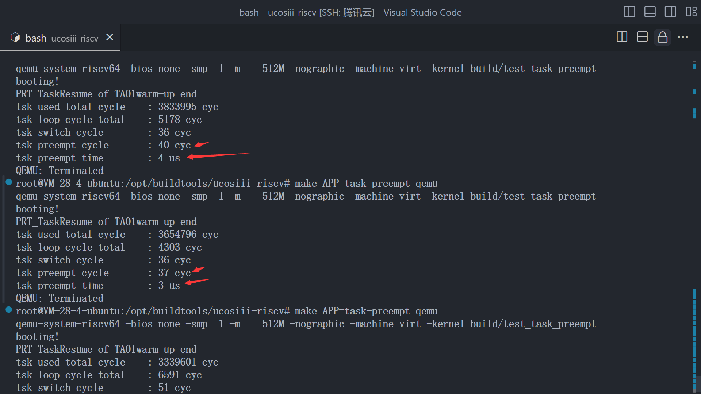
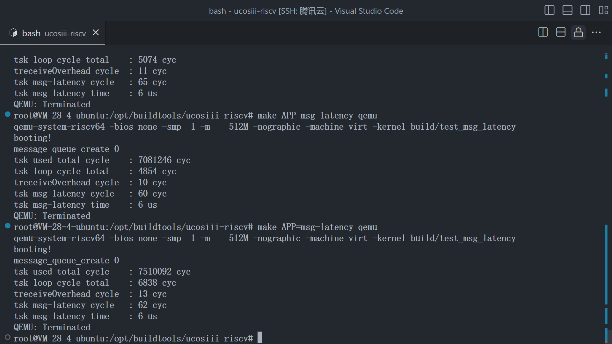
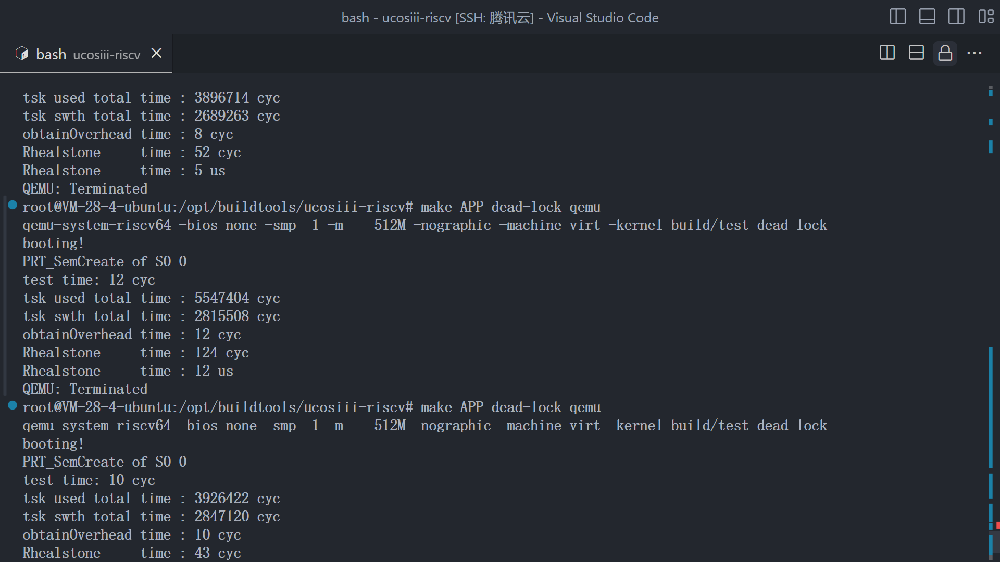

# UCOS-III on QEMU-VIRT

## RISCV32 ，位于分支 main

#### 如何运行？

- **环境介绍**

  - 笔者测试的**QEMU版本**为 ：  **7.2.7**
  - 笔者测试的**Host为 : x86 ubuntu 22.04 lts**
  - 笔者测试的**交叉编译器环境在** ：[Tags · riscv-collab/riscv-gcc (github.com)](https://github.com/riscv-collab/riscv-gcc/tags)
  - 笔者测试的 **GNU Make版本为 ： 4.3**

- **安装环境 ： ubuntu为例子**

  - **qemu**

    - **源码编译安装 -> 自行搜索**

    - **包管理器安装**

      - ```shell
        sudo apt install qemu-system-misc
        ```

  - **make工具**

    - **源码编译安装 -> 自行搜索**

    - **包管理器安装**

      - ```shell
        sudo apt install make
        ```

  - **交叉编译器**

    - **源码编译安装 -> 自行搜索**

    - **包管理器**

      - ```shell
        自行搜索，如果要安装riscv64的交叉编译工具 使用 sudo apt install gcc-riscv64-unknown-elf 
        ```

    - 笔者**测试选择的是** [Tags · riscv-collab/riscv-gcc (github.com)](https://github.com/riscv-collab/riscv-gcc/tags)下的发行版

  - **GDB-MULTIARCH**

    - **源码编译安装 -> 自行搜索**

    - **包管理器**

      - ```shell
        sudo apt install gdb-multiarch
        ```

- **编译步骤**

  - **更新包管理器版本**

    - ```shell
      sudo apt update 
      ```

  - **下载编译工具**

    - ```shell
      sudo apt install make
      sudo apt install qemu-system-misc
      sudo apt install gcc-riscv64-unknown-elf [这是riscv64的工具]
      sudo apt install gdb-multiarch
      ```

  - **检查是否正确安装**

    - ```shell
      make --version
      qemu-system-riscv32 --version
      riscv64-unknown-elf-gcc --version
      gdb-multiarch --version
      ```

  - **克隆仓库并配置Makefile**

    - ```c
      git clone https://github.com/Jer6y/ucos_on_qemu-virt_rv32.git
      cd ucos_on_qemu-virt_rv32
      ```

    - **修改配置Makefile的PREFIX**

    - ```makefile
      PREFIX:=riscv32-unknown-linux-gnu-
      ```

    - 比如**我的交叉编译工具路径在 /opt/buildtools/riscv/bin**

    - 我可以配置我的**PREFIX**为

    - ```Makefile
      PREFIX:=/opt/buildtools/riscv/bin/riscv32-unknown-elf-
      ```

  - **编译**

    - 使用 **make compile** 编译
    - 使用 **make clean** 清理构建的输出内容
    - 使用 **make qemu** **拉起qemu** 进行测试
    - 使用 **make qemuDbg** 在 本机的TCP 端口1234 拉起QEMU DEBUG进程 
      - 再使用 `gdb-multiarch build/kernel.elf` 
      - 再gdb 命令行中输入 `target remote localhost:1234` 即可 进入GDB调试

## RISCV64 ，位于分支 riscv64

#### 如何运行？

- **环境介绍**

  - 笔者测试的**QEMU版本**为 ：  **7.2.7**
  - 笔者测试的**Host为 : x86 ubuntu 22.04 lts**
  - 笔者测试的**交叉编译器环境在** ：[Tags · riscv-collab/riscv-gcc (github.com)](https://github.com/riscv-collab/riscv-gcc/tags)
  - 笔者测试的 **GNU Make版本为 ： 4.3**

- **安装环境 ： ubuntu为例子**

  - **qemu**

    - **源码编译安装 -> 自行搜索**

    - **包管理器安装**

      - ```shell
        sudo apt install qemu-system-misc
        ```

  - **make工具**

    - **源码编译安装 -> 自行搜索**

    - **包管理器安装**

      - ```shell
        sudo apt install make
        ```

  - **交叉编译器**

    - **源码编译安装 -> 自行搜索**

    - **包管理器**

      - ```shell
        sudo apt install gcc-riscv64-unknown-elf 
        ```

    - 笔者**测试选择的是** [Tags · riscv-collab/riscv-gcc (github.com)](https://github.com/riscv-collab/riscv-gcc/tags)下的发行版

  - **GDB-MULTIARCH**

    - **源码编译安装 -> 自行搜索**

    - **包管理器**

      - ```shell
        sudo apt install gdb-multiarch
        ```

- **编译步骤**

  - **更新包管理器版本**

    - ```shell
      sudo apt update 
      ```

  - **下载编译工具**

    - ```shell
      sudo apt install make
      sudo apt install qemu-system-misc
      sudo apt install gcc-riscv64-unknown-elf
      sudo apt install gdb-multiarch
      ```

  - **检查是否正确安装**

    - ```shell
      make --version
      qemu-system-riscv64 --version
      riscv64-unknown-elf-gcc --version
      gdb-multiarch --version
      ```

  - **克隆仓库并配置Makefile**

    - ```c
      git clone https://github.com/Jer6y/ucos_on_qemu-virt_rv32.git
      cd ucos_on_qemu-virt_rv32
      ```

    - **修改配置Makefile的PREFIX**

    - ```makefile
      PREFIX:=../riscv/bin/riscv64-unknown-elf-
      ```

    - 比如**我的交叉编译工具路径在 /opt/buildtools/riscv/bin**

    - 我可以配置我的**PREFIX**为

    - ```Makefile
      PREFIX:=/opt/buildtools/riscv/bin/riscv64-unknown-elf-
      ```

  - **编译**

    - 使用 **make ** 编译
    - 使用 **make clean** 清理构建的输出内容
    - 使用 **make qemu** **拉起qemu** 进行测试
    - 使用 **make qemuDbg** 在 本机的TCP 端口1234 拉起QEMU DEBUG进程 
      - 再使用 `gdb-multiarch build/kernel.elf` 
      - 再gdb 命令行中输入 `target remote localhost:1234` 即可 进入GDB调试

  - **实时性能测试支持**

    - 目前 ucosiii on riscv64 支持 rhealstone , 使用 makefile 传入参数选择需要编译测试的APP
    - 默认make 编译的是 task-switch 上下文性能测试的APP
      - **上下文切换性能测试**			【👆】
      - **任务抢占性能测试**                            【👆】
      - **信号量混洗性能测试**                        【👆】
      - **消息队列延迟性能测试**                    【👆】
      - **中断性能测试**                                   【👇】
      - **死锁解除性能测试**                           【👆】
    - **上下文切换性能测试**
    
      - ```shell
        make APP=task-switch qemu
        ```
    
        
    
      - 
    - **任务抢占性能测试** 
    
      - ```shell
        make APP=task-preempt qemu
        ```
    
      - 
    - **信号量混洗性能测试** 
    
      - ```shell
        make APP=sem-shuffle qemu
        ```
    
      - 
    - **消息队列延迟性能测试** 
    
      - ```shell
        make APP=msg-latency qemu
        ```
    
      - 
    - **死锁解除性能测试** 
    
      - ```shell
        make APP=dead-lock qemu
        ```
    
      - 
    - **中断性能测试**           
    
      - ```
        
        ```
    
        
